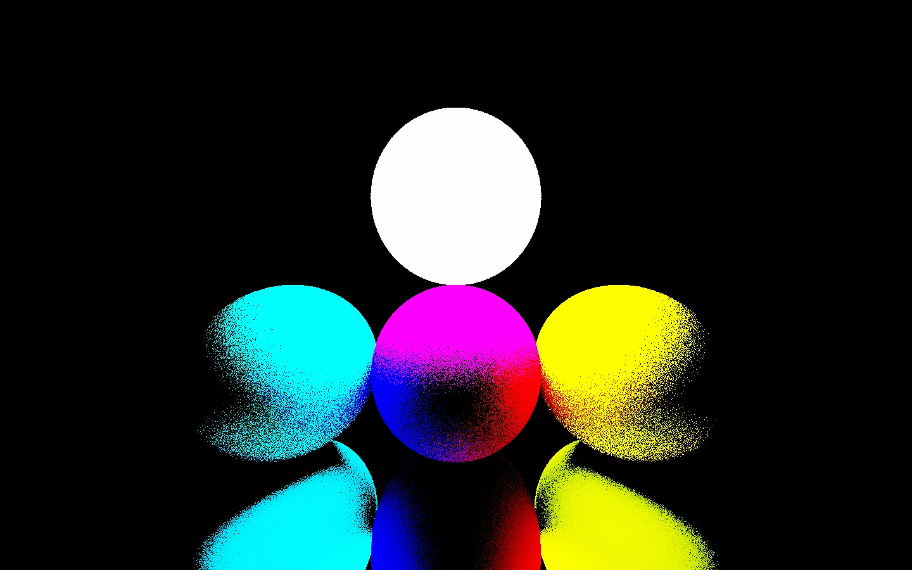

# RayTracing_GEM

Welcome to RayTracing_Gem!
This is a raytracing library written in C#. It was developed for the course _Numerical Methods for Photorealistic Image Generation_ held by Prof. [Maurizio Tomasi][1] at Università degli Studi di Milano (A.Y. 2022-2023).

The contibutors to the project are [Giacomo Aprea](https://github.com/Aprea333), [Emanuele Ricci](https://github.com/emaskusku) and [Michela Dinatolo](https://github.com/micheladinatolo).

## Table of Contents

- [Overview](#overview)
- [Prerequisites](#prerequisites)
- [Usage](#usage)
    - [Render mode](#render-mode)
    - [How to create input files](#how-to-create-input-files)
    - [Demo mode](#demo-mode)
- [Documentation](#documentation)
- [License](#license)
- [Gallery](#gallery)
- [Issue tracking](#issue-tracking)
## Overview
👀

The main functionality of this library is to produce photorealistic images from input files describing a certain scene.
The scene is made of geometric shapes (see the list of available shapes), each one defined by its transformation and its material. Our code offers the possibility to choose between a diffusive, emissive or reflective material.
The code implements three different _backwards ray tracing_ algorithms to simulate how light rays propagate. A camera (perspective or orthogonal) representing the observer will see the world through a 2D screen placed ahead of it and it is defined by its position, the distance from the screen and the aspect ratio.

Once everything (shapes and observer) is defined and in place, the code solves the rendering equation (with different assumptions, depending on the chosen algorithm) and produces an HDR image (in `.pfm` format). Later, the HDR image is converted into LDR formats, in particular `.png`.

## Prerequisites
💻

RayTracing_GEM requires .NET 7.0.201 to run. It is possible to download the latest version [here](https://dotnet.microsoft.com/en-us/download/dotnet/7.0)
This library uses some external libraries. The user should not worry as .NET automatically imports them with the repository download. The libraries are:
- [CommandLineParser](https://github.com/commandlineparser/commandline) to build the Command Line Interface
- SHELL PROGRESS BAR to show a progress bar during while rendering

This library is available for Windows, Linux and MacOS systems.

## Usage
In order to use the library you can clone this repository through the command

  git@github.com:Aprea333/RayTracing_GEM.git

Alternatively, you can download the latest version of the code from the [releases page]

## License
The code is released under GNU General Public License. See the file [REFERENCE](https://github.com/Aprea333/RayTracing_GEM/blob/master/LICENSE) for further informations.

## CHANGELOG
See the file [REFERENCE](https://github.com/Aprea333/RayTracing_GEM/blob/master/CHANGELOG.md) for history

## Gallery

## Issue tracking
If you happen to find any issue or bug with our code, you're more than welcome to let us know.
Either [contact us via email](mailto:michelamaria.dinatolo@studenti.unimi.it,giacomo.aprea@studenti.unimi.it,emanuele.ricci@studenti.unimi.it).

To contribute to RayTracing_GEM, clone this repository locally and commit your code on a separate branch. Please write unit test for your code and then open a _pull request_. If you find any bug in our code, let us kno by opening an _issue_. We will be grateful to any contribution!
